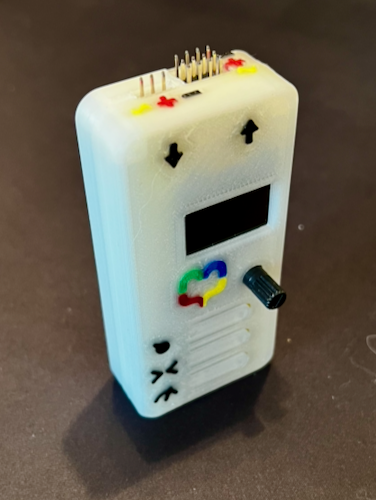

## Overview

RC Servo testers today fall into two categories:
- Cheap servo testers
  - One button to cycle through 3 modes
  - Often inaccurate centering.
- Expensive servo testers that offer a lot more functionality 
  - Cost $60+
  - Take significant time to start up, 
  - Take multiple key presses to get to simple functions.
  
The pressure point for this project was the cycling through modes to go between Manual mode and Center mode. 
I have broken control horns and stripped gears from going through Sweep to get to Manual mode.

So I built a servo tester that offers more functionality than the cheap ones, but can come in at a price point that is affordable.

## Features

### Three buttons
Yup, three buttons. Three buttons for three modes.
- Manual Mode
- Center Mode
- Sweep Mode

### Sweep Speed Control
When in sweep mode, the sweep speed can be adjusted from 0.1 seconds to 2.0 seconds.

### Manual Mode
Adjustable PWM from 1000 to 2000 microseconds using a potentiometer.

### Center Mode
Center mode is stable and accurate, regardless of input voltage.

It has more features than what is listed above, but I'm not going to go into the details for now. ;-)

Doing this project sent me down a few different rabbit holes:
 * Embedded programming using Arduino
 * Circuit design using KiCad
   * Attempting to use AI to help with the design process.
 * Using Sketches, Assemblies, and Components in FreeCad to correctly align objects on the 3d printed case. 

#### Arduino programming

I've done a little bit of Arduino programming before, but this was a deeper dive than previous projects.
In previous projects I've used the Arduino IDE, which while okay, does not offer code analysis. 
It barely offers syntax highlighting and it does not offer code completion.  

So I switched to using CLion from JetBrains. With the PlatformIO plugin, I have an IDE that I am very familiar with.
It offers code completion, syntax highlighting, dependency management, and code analysis. 

Fairly far along in the project, I ran into a problem with the performance of the code.  Instead of getting a stable 50Hz 
I was getting jumpy, unstable PWM.  It turns out the problem was that I am using a SSD1306 OLED with i2c communication, 
and the Adafruit display library.  Using the Adafruit library meant that the whole display was being updated every time
the screen changed.  This was taking up all the memory and updating the display 40+ms which meant the Arduino could 
not keep up with the 50 Hz PWM rate.  I replaced the Adafruit library with the SSD1306AsciiWire library, re-wrote 
the display code to ONLY update the parts of the screen that changed, and got the average screen refresh time down to 
less than 10 ms allowing the Arduino to keep up with the 50 Hz for PWM.

Getting rid of the Adafruit library also reduced the ram usage significantly as it was using a buffer that took up
a lot of the very limited memory on the Arduino.

Lessons learned here:
 * Arduino's have very limited ram.
 * AdaFruit libraries offer a lot of functionality at the cost of ram.
 * i2c is slow, even at 400kHz.

#### Circuit design

The last time I designed a circuit was in 2000.  It was part of a 100-level electronics class.  
So it has been a while, and the circuit was pretty basic. 

We live in the dawning of the AI age, and I was hoping that the AI could help with the design process.
I told Claude about the project, and it helped me design what I thought was a pretty good circuit.
I wanted to be able to have power come in from either the power in port, the servo out port, or use the power
from the Arduino's USB port. 

I wanted to be pedantic about power loss and prevent reverse polarity, so I was trying to build and use an "ideal diode"
to direct the power through the various power rails.  I also designed it using "high side switching" meaning that the FETs
were on the positive side of the circuit. 

I used [wokwi](https://wokwi.com) to do a very early virtual prototype of the circuit.  Wokwi does not have FETS but it
does have Relay's which can be used to simulate P and N channel MOSFETs. So that's what I did. I emulated N channel MOSFETs
using Relay's on the high side of the circuit.  It worked exactly as I wanted it to.

From there, I migrated to KiCad, designed the circuit, chose the components.

Once I had the design in KiCad, I built a physical prototype on a breadboard. The prototype worked as I wanted it to. 
However, I was losing more voltage than I thought I would.  I put this down to using over-sized components vs the surface
mount ones the PCB would use.

Happy that the circuit worked, I exported the Gerber files and set it off to [JLCPCB](https://jlcpcb.com) to have some boards made.

As soon as the boards arrived, I realized I made a mistake.  I had chosen the wrong SSD1306 footprint. I had chosen the 
Adafruit SSD1306 footprint. But I did not buy the Adafruit SSD1306. I bought some simple 128x64 I2C SSD1306 modules.
These modules are compatible with the Adafruit SSD1306 I2C, but have a very different footprint.

Luckily, the four pins that matter to the circuit match, but the screen ends up off center and lower than where I planned.

After assembling the first board, I was still losing more voltage than I thought I would. This (too late) is when I realized
that AI had led me down a path that would not work. P-Channel MOSFETs require the gate voltage to be HIGHER than source voltage.
I was the 5 volts from the Arduino as the gate voltage and trying to switch a 6 volt source. 

I had three options:
1. Add in a voltage booster (charge pump) to boost the gate voltage above that of the supply voltage.
2. Redesign the whole thing using low side switching and N-Channel MOSFETs.
3. Give up on the idea of "Ideal Diode" and use simple Schottky diodes instead. 

Since the circuit already had Schottky diodes, in it, and the voltage loss I would be taking is really not bad, I decided to go with option 3.
This also meant that not only could I use the components I already had, I could still use the PCBs that I had created by simply 
flipping one diode around, shorting out another, and jumping a 3rd diode instead of a MOSFET. 

Lessons learned here:
 * Don't Trust AI to actually know what it's talking about
 * Don't try to overcomplicate things going for perfection instead of "good enough."
 * Quadruple check your footprints before ordering the boards.

#### Case design

I use FreeCad for all of my 3d cad work, but the case for this project had a couple of extra challenges.
First, I wanted to be able to very-accurately design the case around the PCB and components. 
Second, I wanted it to be multicolor. 

KiCad and FreeCad work very well together.  In KiCad, I imported the CORRECT SSD1306 module, aligned it to the Adafruit footprint,
Loaded in the rest of the components, and then exported the whole PCB with all components as a 3mf (3d Manufacturing Format) file.

In FreeCad, I imported the 3mf file, and started work on the case. Using the actual pcb dimensions as a guide, I was able to 
create a very accurate case very quickly.

The more difficult part was getting the case to be multicolor.  I tried the lazy route first and sketched all the icons 
directly onto the case, but this made it difficult to create the 2ndary bodies used for multicolor 3d printing. 

I ended up reverting to the blank case and taking a detour to figure out how to:
1. Create separate bodies for each icon / label
2. Create components to hold the separate bodies as a grouped object.
3. Use a sketch inside an assembly to correctly and accurately position the components.
4. Import those back into the main case design as cutting tools and as printable bodies. 

### Final Result 

The final result for this iteration is a functional servo tester that satisfied all of my original requirements
(and then some).  

I ended up building a few of these, so I am planning on selling some of them on E-bay. 
Sure, they are not production quality, but they are fully functional, more useful than the cheap ones, 
and will be sold cheaper than the expensive ones. 

