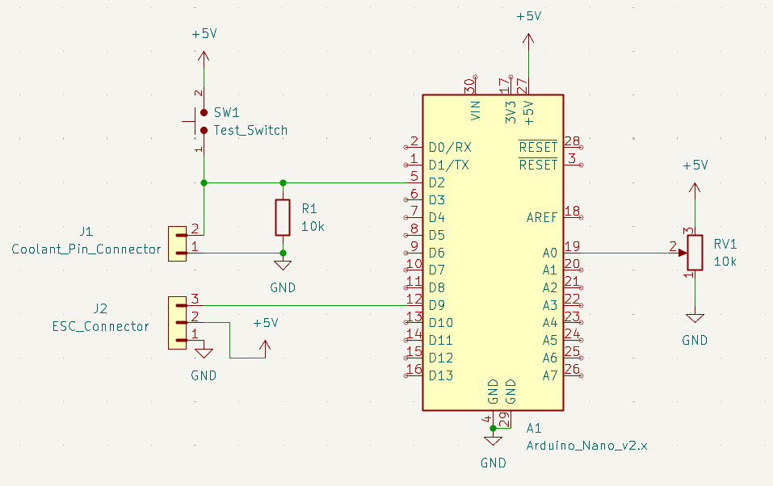
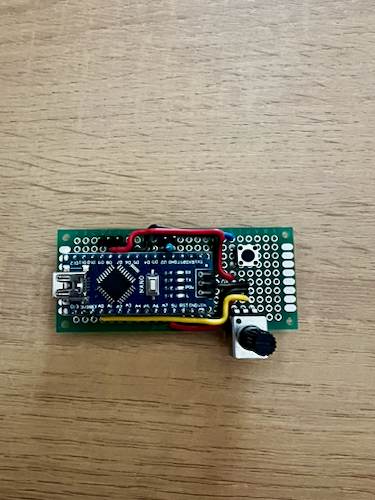
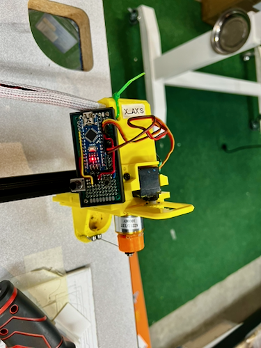
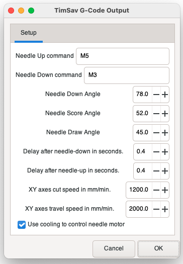

## Overview

The TimSav needle cutter is a CNC-driven cutting tool for cutting foam boards. 
It is a 2.5d CNC machine that uses an RC Servo as the Z-axis instead of a standard stepper motor axis. 
To do this, the laser / motor speed control PWM signal is used as the Z-axis signal.  
Controlling the motor is left to the operator using a simple servo tester to drive the motor's speed.

This project allows GRBL to control the needle cutter motor by using the coolant output as an on/off signal 
that is interpreted by the Arduino and converted to PWM signals for the motor driver.

**GitHub:** [DavidJJ/TimSav_Motor_Driver](https://github.com/DavidJJ/TimSav_Motor_Driver)

## The Problem

The goal was simple: allow G-code commands to turn the needle cutter motor on and off during a job. 
The obvious approach would be a second PWM output directly from the GRBL controller — but that turned out to be a dead end.

I tried for multiple hours to figure out a way to add another PWM output to GRBL, but it was impossible.
GRBL uses all the Arduino's hardware timers for stepper pulse generation, spindle PWM, and other internal functions. 
There are no timers left to assign to a new PWM output. 
Adding one directly to GRBL isn't possible without a significant rework of the firmware. 

## Design Notes

- GRBL coolant pin used as control signal (`M8` = motor on, `M9` = motor off)
- Dedicated Arduino interprets the signal and drives the motor controller
- No GRBL firmware modifications required
- Provide a way to adjust the motor speed. 
- Provide a way to test the motor speed without g-code.

## The Solution

GRBL has a coolant control function — accessible via `M8` (coolant on) and `M9` (coolant off) G-code commands — that outputs a simple on/off digital signal. 
This pin isn't used on the TimSav machine, making it a available as a hijack point for motor control.

A dedicated Arduino board reads that coolant signal and drives the motor controller accordingly. 
The G-code program uses `M8`/`M9` to turn the needle cutter on and off at the right points in the job, 
and the Arduino handles the actual motor driver interface.

As with my Servo Tester project, I used a potentiometer to adjust the PWM output for controlling motor speed.
I also added a button that pulls the input pin high to test the motor speed without g-code.

Since this was a one-day, one-off project, I did not design a full PCB for it. 
I assembled it directly onto a perf-board and tested it on the machine.

## Build Gallery

## Updating the TimSav InkScape Plugin

To use the new functionality, I needed to update the [TimSav InkScape plugin](https://github.com/DavidJJ/inkscape-timsav) to support the new G-code commands.
I added a new parameter to the save dialog that allows the user to enabled or disable using coolant control as motor control.

The updated plugin is available on GitHub and I verifed that it works with the latest version of InkScape.